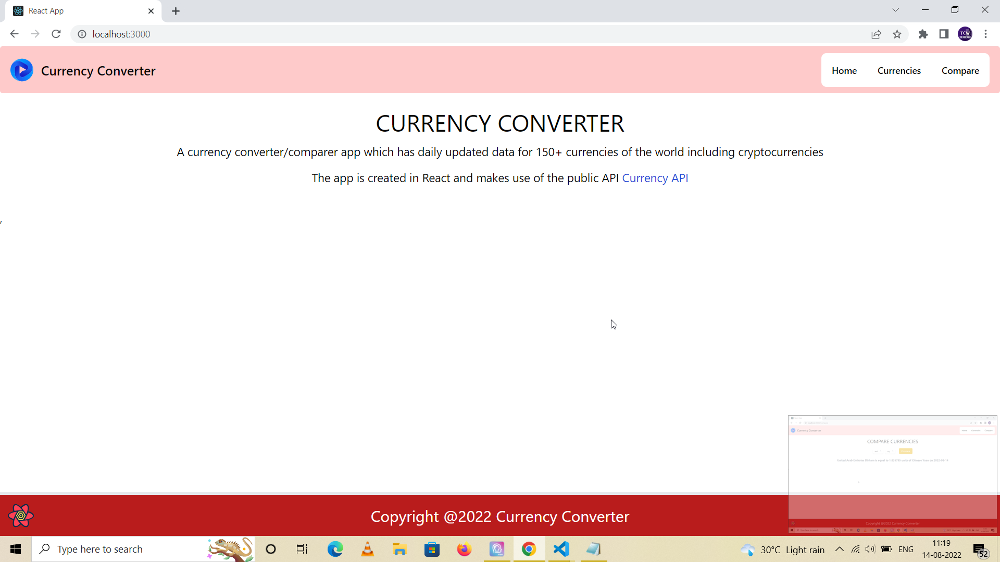

# Currency Converter App in React using Headless UI and TailwindCSS

A currency converter App which uses data from the API - https://github.com/fawazahmed0/currency-api. It is an open source 100% free API with no rate limits and daily updated currency data for over 150+ currencies in the world including cryptocurrencies.

## Features

* List of 150 + currencies
* Convertion from one currency to another 
* Compare a given currency against all other currencies

## Technologies used

* React - For UI development
* Headless UI - For dynamic animated components using Tailwind CSS
* Tailwind CSS - For CSS component styling
* React-query - For cached API calls

## Available Scripts

In the project directory, you can run:

### `npm start`

Runs the app in the development mode.\
Open [http://localhost:3000](http://localhost:3000) to view it in your browser.

The page will reload when you make changes.\
You may also see any lint errors in the console.

### `npm test`

Launches the test runner in the interactive watch mode.\
See the section about [running tests](https://facebook.github.io/create-react-app/docs/running-tests) for more information.

### `npm run build`

Builds the app for production to the `build` folder.\
It correctly bundles React in production mode and optimizes the build for the best performance.

The build is minified and the filenames include the hashes.\
Your app is ready to be deployed!

See the section about [deployment](https://facebook.github.io/create-react-app/docs/deployment) for more information.

### `npm run eject`

**Note: this is a one-way operation. Once you `eject`, you can't go back!**

If you aren't satisfied with the build tool and configuration choices, you can `eject` at any time. This command will remove the single build dependency from your project.

Instead, it will copy all the configuration files and the transitive dependencies (webpack, Babel, ESLint, etc) right into your project so you have full control over them. All of the commands except `eject` will still work, but they will point to the copied scripts so you can tweak them. At this point you're on your own.

You don't have to ever use `eject`. The curated feature set is suitable for small and middle deployments, and you shouldn't feel obligated to use this feature. However we understand that this tool wouldn't be useful if you couldn't customize it when you are ready for it.

## Update

This API no longer works, this project is now a playground for testing various React features.

## Project Screenshots

Screenshots would be added as progress is made with this application. Screenshot of the homepage. It just contains a help text and link to the original API used to build this application.

List of currencies. Pagination might be applied on the front-end as an improvement layer over the existing app in the future.

Compare currency page. This page would be used to compare 150+ currencies to each other.

## Project Status

This is a minor hobby project which I created once I came across this currency converter API on Github. A lot of these APIs are 
paid and their free versions only have limited number of requests you can make on a daily and hourly basis.
